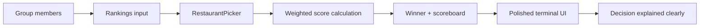

## What it does

The app collects ranked restaurant preferences from each person, scores every restaurant using the group’s combined votes, and prints a polished explanation of the final winner.

## The diagram

## How AI was used

| Feature | What we did | Why it mattered |
| --- | --- | --- |
| Initial implementation | Used AI to draft the ranking model and CLI structure | Reduced setup time and kept the code clean |
| Edge cases | Added duplicate detection and alphabetical tie-breaking | Prevented ambiguous or invalid inputs |
| Test-first workflow | Wrote and refined failing tests before finalizing behavior | Kept the logic dependable and reviewable |
| Presentation polish | Improved the terminal UI and summary output | Made the demo easier for judges to understand |

## Why this is a strong demo

- The decisions are explicit and easy to explain
- The scoring is deterministic and testable
- The CLI output reads naturally to non-technical judges
- The implementation stays small, fast, and easy to verify

## What we’d do next

- Add a small web UI or mobile-friendly version
- Load rankings from a shared file or CSV export
- Add restaurant metadata like cuisine, price, and distance
