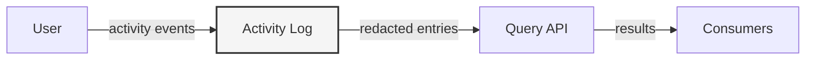

## What it does

The activity log captures user actions, stores them with timestamps, and lets callers query by actor or time range while redacting sensitive metadata.

## The diagram

## How we used AI

| Feature | What we did | What it changed |
| --- | --- | --- |
| Plan Mode | Resolved the four ambiguities in the activity-log spec before coding | Made the ordering, redaction, boundaries, and empty-result behavior explicit and testable |
| TDD | Wrote failing tests first for record, reject, redaction, and time-range behavior | Gave us a precise target and kept the implementation honest |
| Review | Reviewed the code with a second model | Caught edge cases before final verification |
| Documentation | Wrote the project README and judge summary | Made the repo easy to understand and present |

## What we'd do next

- Add richer filtering, such as action-type queries or metadata-based lookups.
- Add a small public API layer and a sample consumer to demonstrate real-world usage outside the test harness.
