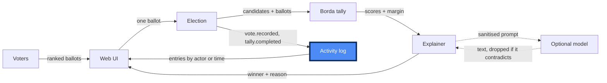

# Where are we eating?

## 1. What it does

Everyone ranks the lunch options once, and the app picks one winner and says in
plain words how it got there.

## 2. The diagram

## 3. How we used AI

| Feature      | What we did                                                                                                                                   | What it changed                                                                                                                                                                                                                        |
| ------------ | --------------------------------------------------------------------------------------------------------------------------------------------- | -------------------------------------------------------------------------------------------------------------------------------------------------------------------------------------------------------------------------------------- |
| Plan Mode    | Planned with Opus 5 before any code, and resolved the four `[NEEDS CLARIFICATION]` markers into the Decisions table of `spec/activity-log.md` | Caught that "known actor with nothing to show" is unreachable without a range, so `queryByActor` took an optional time range instead of remembering rejected writes                                                                    |
| TDD          | `@tdd-red` wrote 83 failing tests from the specs; `@tdd-green` made them pass without editing one                                             | Red found 5 of its own tests passing off the stub's `throw`, and added positive controls so they could actually fail                                                                                                                   |
| Caveman      | `@caveman` compressed `src/engine/tally.ts`                                                                                                   | 65 → 59 lines, one pass over each ballot instead of two, 83 tests still green                                                                                                                                                          |
| Second model | Code written by Opus 5, reviewed by GPT-5.5 via `@review`                                                                                     | Found 3 defects the author missed: model text could call a tie-break a landslide, a ballot was kept when its log write threw, and nested `{profile:{password}}` was never redacted. Specs tightened, then red → green again: 102 tests |
| Documenter   | `@documenter` wrote `README.md` from the repo                                                                                                 | Refused two claims we fed it that the code did not support, including "the LLM client is never called in tests"                                                                                                                        |

## 4. What we'd do next

- **Nothing under `src/ui/` is tested.** The engine, log, explainer and wiring
  have 102 tests; the React layer has zero. That is the first gap a real user
  would fall into.
- **Revisit irreversible redaction (REQ-004).** It is the safe call today, but
  an operator debugging a live incident cannot recover a value they redacted by
  accident — a sealed audit copy may be the better trade.
